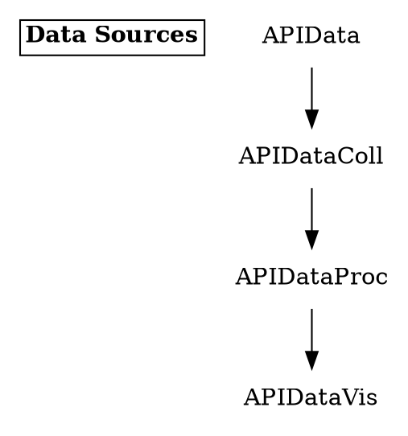

```graphviz
digraph G {
    node [shape=plaintext];
    
    DataSources [label=<
    <table border="0" cellborder="1" cellspacing="0">
        <tr>
            <td><b><font point-size="14">Data Sources</font></b></td>
        </tr>
    </table>
    >];
    
    APIData -> APIDataColl -> APIDataProc -> APIDataVis;
}
```
